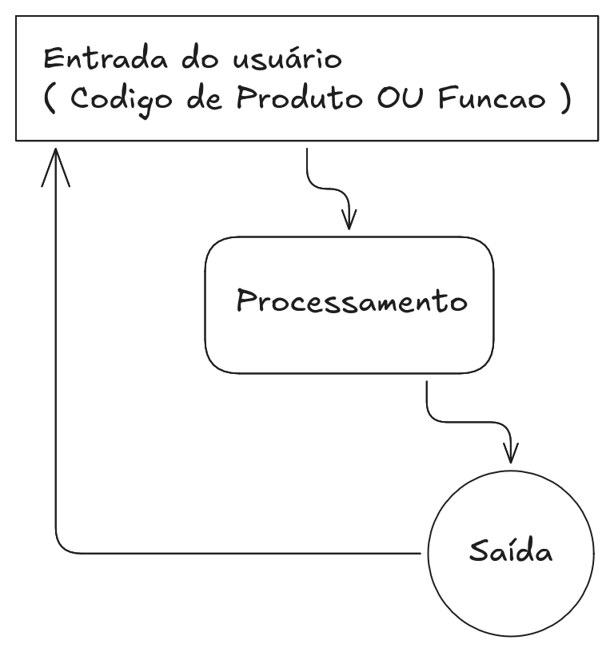

# 🛒 Sistema de PDV em linha de comando

Essa é uma aplicação simples que simula a execução de um sistema PDV (Ponto De Venda) de um Super Mercado no terminal. O sistema conta com Frente de Caixa e ferramentas de gerenciamento para o usuário.

> ⚙️ Em construção... 

## 📌 Features
- [x] 💵 Sistema de Caixa
- [x] 📦 Controle de estoque 
- [x] 💿 Persistência em Banco de Dados

## 💵 Como usar: Frente de Caixa

### # Funções
| entrada | função                  |
|---------|-------------------------|
| f       | Finalizar compra / Sair |
| c       | Cancelar item           |

### # Fluxo da aplicação

> O usuário ( operador do caixa ) gerencia a aplicação por meio de códigos para produtos e funções, assim como em um PDV real.



### # Exemplo de uso
```
>>>>>> CASHIER <<<<<<
>>> 445
+-----------------------------------------------------------------------------------------+
|       | codigo          | nome                 |        preco |      qtd |        total |
+-----------------------------------------------------------------------------------------+
| #1    | 445             | Melancia             | R$      9.98 |    1 uni | R$      9.98 |
+-----------------------------------------------------------------------------------------+
| Melancia             R$9.98           1 uni |
+---------------------------------------------+
| SUBTOTAL = R$9.98       |
+-------------------------+
>> f

>> Tecle ENTER para voltar <<
Qual a forma de pagamento?
   [0] Dinheiro
   [1] Débito
   [2] Crédito
   [3] Pix
   [4] Crédito manual
   [5] Boleto
   [6] Vale troca
>> 0
>> Valor de entrada: 10.00

AGUARDE...

TROCO = R$0.02
AGUARDE...
>> Sessão finalizada <<
```

## 💼 Como usar: Rotinas
A área de gerenciamento do PDV é baseada em rotinas, aplicações desaclopadas com funções específicas ( assim como sistemas ERPs robustos ). O objetivo dessa abordagem é garantir que a aplicação possa crescer de forma gradual e segura, evitando que um problema pequeno quebre o funcionamento do programa. 

> ⚙️ Feature em desenvolvimento...

Rotinas:
-  [100] Controle de estoque
-  [200] Financeiro
-  [220] Gerenciamento


## 📝 To do List
- [x] Implementar Login de usuário 🔐
- [x] Implementar registro de vendas 🏷️️
- [x] Implementar pesagem de produtos no PDV Frente de Caixa 🧮
- [ ] Criar rotina: Entrada de produtos 📦
- [ ] Criar rotina: Cadastro/gerenciamento de usuários 👥
- [ ] Criar. rotina: Controle de estoque & precificação de produtos 🔍
- [ ] Criar rotina: Dashboards 📉

### 🚀 Últimas atualizações

- Novo algoritmo para capturar entradas de multiplicações de produtos no PDV Frente de caixa, com o seguinte padrão:
```
INPUT >> "MxP"
M = Multiplicador ( peso ou quantidade )
P = Código do produto
```
- Upgrade geral no PDV Frente de caixa: refatoração de código desnecessário;

23/07/2025
