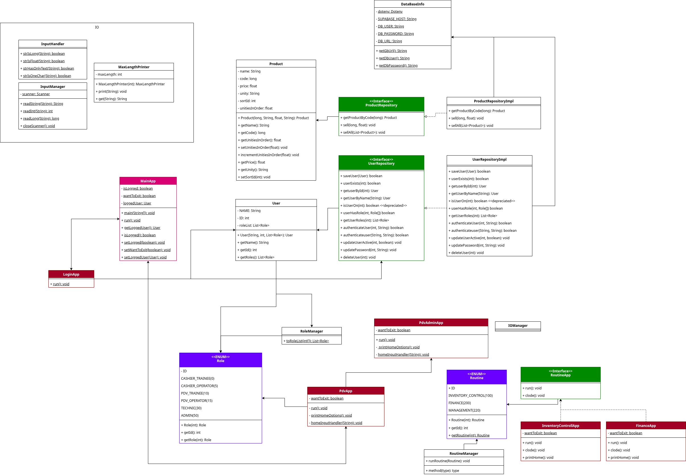

# 🛒 Sistema de PDV em linha de comando
> ⚙️ Em construção...
>
> Sinta-se avontade para contribuir!


Essa é uma aplicação que simula um sistema PDV (Ponto De Venda) de um Super Mercado no terminal.
O sistema é baseado em dois módulos principais:

- 💵 PDV Cashier
  
  Frente de caixa para vendas.

- 💼 PDV Admin
  
  Sistem de gerenciamento baseado em rotinas desaclopadas, cada uma com sua função específica.

<hr>

## Tecnologias utilizadas

- JavaSE
- JDBC Puro
- SQL
- PostgreSQL
- SupaBase
- Maven + Shade Plugin
- Dotenv Lib
- Git

<hr>

## Requisitos
- Git 2.23+
- Java SE 17+

## Como executar
- Clone o projeto
    ```
    git clone https://github.com/filipemartinsdev/pdvsystem
    cd pdvsystem
    ``` 
- Copie o arquivo .env.example
    - Linux / MacOS
    ```
    cp .env.example .env
    ```
  
    - Windows
    ```
    copy .env.example .env
    ```
- Execute o programa
  ```
    java -jar pdvsystem.jar
  ```

### 👤 Usuários para teste

| NOME        | SENHA     |
|-------------|-----------|
| testeadm    | 000       |
| testecaixa  | 000       |


## 💵 Como usar: Frente de Caixa

### # Funções
| ENTRADA | FUNÇÃO                  |
|---------|-------------------------|
| f       | Finalizar compra / Sair |
| c       | Cancelar item           |
| m       | Consulta de preços      |


## 💼 Como usar: PdvAdmin
O PdvAdmin é um módulo da aplicação voltado ao gerenciamento do sistema. Nesse sentido, o usuário possui acesso a diversas rotinas de acordo com suas permissões gravadas.


### Rotinas

| #ID        | NOME    | DETALHES |
|-----------|---------|----------|
| 100       | Estoque | Gerenciamento direto dos produtos em estoque |
| 200       | Financeiro | Histórico de vendas |
| 220       | Gerenciamento | Administração de usuários e configurações extras do PDV |


## Diagrama de Classes


## 📝 To do List
- [x] Implementar Login de usuário 🔐
- [x] Implementar registro de vendas 🏷️️
- [x] Implementar pesagem de produtos no PDV Frente de Caixa 🧮
- [ ] Criar rotina: Entrada de produtos 📦
- [ ] Criar rotina: Cadastro/gerenciamento de usuários 👥
- [ ] Criar. rotina: Controle de estoque & precificação de produtos 🔍
- [ ] Criar rotina: Dashboards 📉

### 🚀 Últimas atualizações
- Upando projeto para a nuvem: online publicamente! ☁️

28/07/2025
